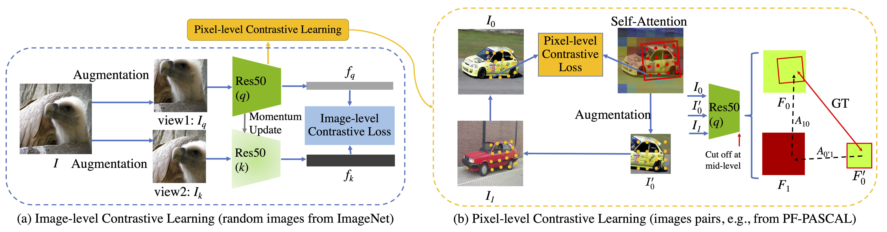
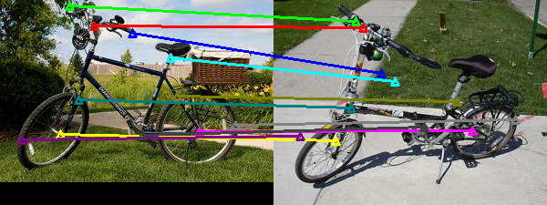
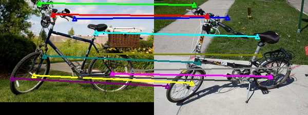
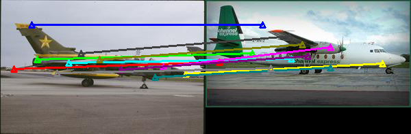
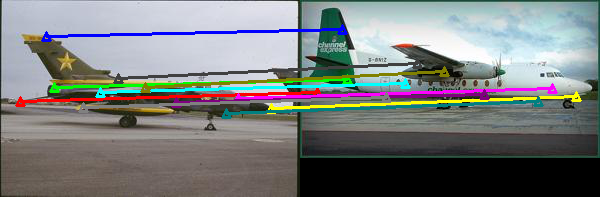
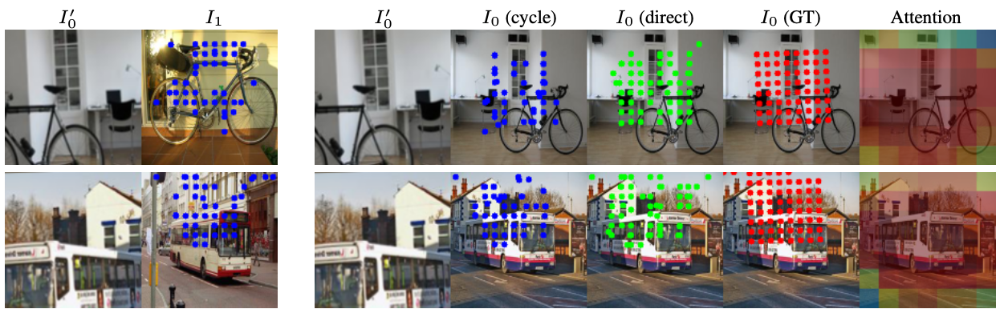

# [Learning Contrastive Representation for Semantic Correspondence](https://arxiv.org/abs/2109.10967)

Taihong Xiao, Sifei Liu, Shalini De Mello, Zhiding Yu, Jan Kautz, Ming-Hsuan Yang

***International Journal of Computer Vision, 2022***

<div align="center">

</div>
<div align="center">
Overview of our framework
</div>
<br/>


## Data Preparation

You can download the required datasets using the following links and put them into the directory `Datasets_SCOT`.

- [PF-PASCAL](https://www.di.ens.fr/willow/research/proposalflow/)
- [PF-WILLOW](https://www.di.ens.fr/willow/research/proposalflow/)
- [SPair-71k](https://cvlab.postech.ac.kr/research/SPair-71k/)

You may also refer to this [script](https://github.com/juhongm999/hpf/blob/master/data/download.py) for downloading those datasets.

Also, we need to prepare the ImageNet dataset.


## Environment

- pytorch==1.5.1
- torchvision==0.6.1
- opencv-contrib-python
- scipy==1.2.1
- scikit-image
- pandas
- requests
- gluoncv-torch

We can also use conda to create the environment.
```
conda env create -f environment.yml
```

## Pretrained Models

We here provide pretrained models of ImageNet. You may download the pretrained models using the following command.

```bash
mkdir pretrained_models
cd pretrained_models
wget http://vllab1.ucmerced.edu/~taihong/ContrastiveCorrespondence/pretrained_models/moco.pth.tar
```

## Training, Validation and Testing

Please refer the `training` and `validation_and_test` directory for detailed instructions.


## Results

**Visualization of the baseline and our method on the PF-PASCAL dataset.**

Baseline    |  Ours
-------------------------|-------------------------
  |  
  |  


**Visualization of pixel-level contrastive learning.**
The first two columns show correspondence predictions across different images (i.e., the blue dots in the second image denote the correspondence of each pixel in the first image). The remaining five columns show correspondence predictions from the augmented patch images to their source images, where the red dots denote the correspondence ground truth (where the patch image is cropped from the source image), blue or green dots indicate the correspondence prediction based on the cycle affinity matrix or affinity matrix. The last column shows the self-attention map on which the randomly cropped augmented image is based. 


## Citation

```
@article{xiao2022learning,
  title={Learning contrastive representation for semantic correspondence},
  author={Xiao, Taihong and Liu, Sifei and De Mello, Shalini and Yu, Zhiding and Kautz, Jan and Yang, Ming-Hsuan},
  journal={International Journal of Computer Vision},
  volume={130},
  number={5},
  pages={1293--1309},
  year={2022},
  publisher={Springer}
}
```


## [License](https://github.com/NVlabs/Contrastive-Correspondence/blob/master/LICENSE)

Copyright (c) 2023-24, NVIDIA Corporation & affiliates. All rights reserved. Licensed under the [CC BY-NC-SA 4.0](https://github.com/NVlabs/Contrastive-Correspondence/blob/master/CC-BY-NC-SA-4.0.md) (Attribution-NonCommercial-ShareAlike 4.0 International)


